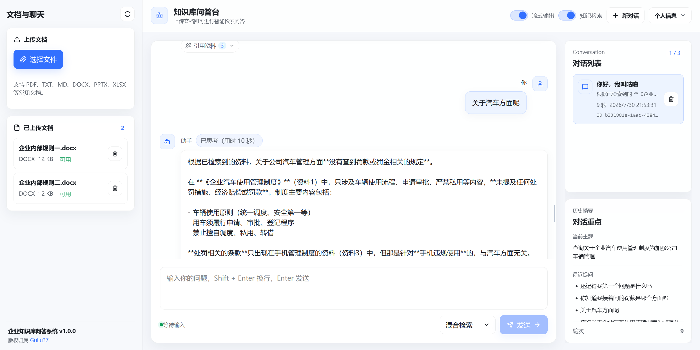
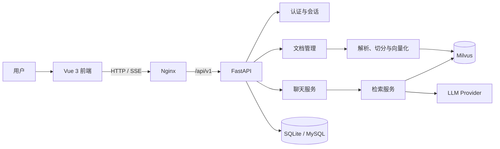
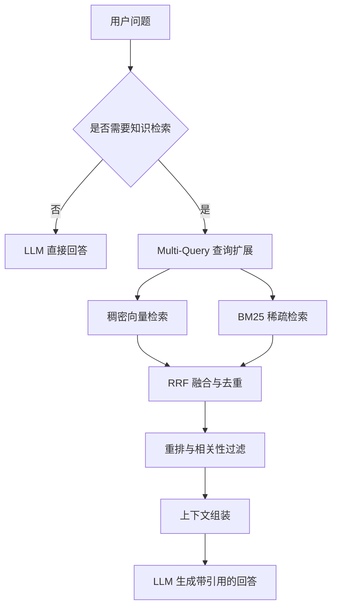

# 企业知识库问答系统



一个面向企业内部资料的 RAG（检索增强生成）问答系统。用户上传文档后，系统会完成解析、切分和向量化；在对话中按需检索知识库，以流式方式生成可追溯至引用资料的回答。

## 功能概览

- 文档入库：支持 PDF、TXT、Markdown、Word、PowerPoint 和 Excel 等常见办公文档，提供上传、状态跟踪、内容预览与删除。
- 智能问答：根据问题自动选择直接回答或知识库问答，支持流式 SSE 输出与引用资料展示。
- 混合检索：支持稠密向量检索、BM25 稀疏检索和混合检索，并结合 Multi-Query、RRF 融合、重排和相关性过滤提升召回质量。
- 会话与记忆：支持多会话管理、历史会话切换与删除；长期语义记忆可写入 Milvus 并在后续对话中召回。
- 账号与安全：提供注册、登录、JWT Access/Refresh Token 续签、修改密码和会话失效控制。
- 工程化部署：前后端分离，支持本地开发与 Docker Compose 部署；默认使用 SQLite，也可通过 Compose profile 启用 MySQL。

## 技术栈

| 模块 | 技术 |
| --- | --- |
| 前端 | Vue 3、Vite、Lucide、Nginx |
| 后端 | Python、FastAPI、Uvicorn、SQLAlchemy、Loguru |
| RAG | LangChain、BGE Embedding、BM25、RRF、Reranker |
| 模型服务 | Ollama、OpenAI、DeepSeek、OpenRouter、Anthropic |
| 数据存储 | Milvus、SQLite（默认）/ MySQL（可选） |
| 部署 | Docker、Docker Compose |

## 架构



## 快速开始

### 前置条件

- Python 3.10 或更高版本
- Node.js 18 或更高版本
- 可访问的 Milvus 2.x 实例
- 一个可用的模型服务：Ollama，或已配置 API Key 的 OpenAI、DeepSeek、OpenRouter、Anthropic
- Docker 与 Docker Compose（仅容器化部署需要）

### 1. 配置后端

```bash
cd backend
python -m venv .venv

# Windows PowerShell
.venv\Scripts\Activate.ps1

# Linux / macOS
source .venv/bin/activate

pip install -r requirements.txt
```

复制环境变量模板：

```bash
# Windows PowerShell
Copy-Item .env.example .env

# Linux / macOS
cp .env.example .env
```

编辑 `backend/.env`，至少完成以下配置：

```dotenv
# 选择模型供应商，并填写该供应商所需的模型与鉴权配置
LLM_PROVIDER=ollama

# 连接可访问的 Milvus 实例
MILVUS_HOST=127.0.0.1
MILVUS_PORT=19530

# 生产环境必须替换为随机强密钥
JWT_SECRET_KEY=replace-with-a-random-secret
```

使用本地 BGE 模型时，确保 `BGE_MODEL_NAME` 指向正确的模型目录。离线环境可设置 `BGE_LOCAL_FILES_ONLY=true`，避免运行时从 Hugging Face 下载模型。

### 2. 启动后端

```bash
cd backend
uvicorn app.main:app --host 0.0.0.0 --port 8000 --reload
```

后端启动后可访问：

- API 文档：`http://127.0.0.1:8000/docs`
- 健康检查：`http://127.0.0.1:8000/health`

服务启动时会初始化元数据数据库，并尝试连接和初始化 Milvus collection。Milvus 暂不可用时后端仍会启动，但文档入库与检索功能不可用。

### 3. 启动前端

```bash
cd frontend
npm install
npm run dev
```

开发服务器默认运行于 `http://127.0.0.1:5173`，并将 `/api/v1` 请求代理到后端 `http://127.0.0.1:8000`。

### 4. Docker Compose 部署

先准备后端配置文件：

```bash
# Windows PowerShell
Copy-Item backend\.env.example backend\.env

# Linux / macOS
cp backend/.env.example backend/.env
```

启动前后端：

```bash
docker compose up -d --build
```

如需使用 MySQL：

```bash
docker compose --profile mysql up -d --build
```

前端容器监听宿主机 `80` 端口。当前 Compose 文件不包含 Milvus 服务，请在 `backend/.env` 中将 `MILVUS_HOST` 配置为容器可访问的 Milvus 地址。

## 使用流程

1. 使用初始管理员账号登录。默认账号由 `BOOTSTRAP_ADMIN_USERNAME` 和 `BOOTSTRAP_ADMIN_PASSWORD` 配置，部署前请修改默认密码。
2. 在左侧上传企业资料，等待文档状态变为“可用”。
3. 提出问题，并选择是否启用知识检索、流式输出以及检索策略。
4. 在回答中查看引用资料，继续追问或创建新的会话。

## 检索流程



## 项目结构

```text
.
├── backend/
│   ├── app/
│   │   ├── api/routes/       # 认证、文档、检索、聊天接口
│   │   ├── core/             # LLM 与 Embedding 初始化
│   │   ├── rag/              # 检索相关实现
│   │   ├── services/         # 认证、文档、聊天、记忆服务
│   │   ├── storage/          # SQLite 元数据与 Milvus 存储
│   │   ├── data/             # 运行时生成的数据目录
│   │   └── main.py
│   ├── models/               # 可选的本地 Embedding 模型
│   ├── tests/
│   ├── Dockerfile
│   └── requirements.txt
├── frontend/
│   ├── src/
│   ├── Dockerfile
│   ├── nginx.conf
│   └── package.json
├── docs/images/demo.png
├── docker-compose.yml
└── README.md
```

## 关键配置

| 配置项 | 说明 |
| --- | --- |
| `LLM_PROVIDER` | 默认模型供应商，可选 `ollama`、`openai`、`deepseek`、`openrouter`、`anthropic` |
| `MILVUS_HOST` / `MILVUS_PORT` | Milvus 服务地址 |
| `DATABASE_URL` | 元数据数据库连接；默认使用 SQLite |
| `EMBEDDING_PROVIDER` / `BGE_MODEL_NAME` | 向量化模型与本地模型路径 |
| `BGE_LOCAL_FILES_ONLY` | 离线模式下仅从本地加载 BGE 模型 |
| `USE_DENSE_RETRIEVER` / `USE_SPARSE_RETRIEVER` / `USE_HYBRID_RETRIEVER` | 检索策略开关 |
| `DENSE_WEIGHT` / `SPARSE_WEIGHT` | 混合检索权重 |
| `CORS_ORIGINS` | 允许访问 API 的前端域名列表 |

完整的配置项及示例请查看 [backend/.env.example](backend/.env.example)。

## 向量数据库 Schema

项目使用 Milvus 存储文档切块向量和长期记忆向量。默认向量维度为 `EMBEDDING_DIMENSION=768`，如更换 Embedding 模型，需要同步调整 Milvus collection 的 `vector` 维度。

### 文档向量 Collection

默认 collection 名称：`doc_chunks`，对应配置项 `MILVUS_DOC_COLLECTION_NAME`。

| 字段名 | Milvus 类型 | 约束 / 说明 |
| --- | --- | --- |
| `pk` | `INT64` | 主键，`auto_id=True` |
| `text` | `VARCHAR(65535)` | 原始文本字段 |
| `vector` | `FLOAT_VECTOR(768)` | 文档切块向量，维度由 `EMBEDDING_DIMENSION` 控制 |
| `document_id` | `VARCHAR(65535)` | 文档 ID |
| `chunk_index` | `INT64` | 文档内切块序号 |
| `source_name` | `VARCHAR(65535)` | 来源文件名 |
| `chunk_text` | `VARCHAR(65535)` | 切块正文 |
| `file_type` | `VARCHAR(65535)` | 文件类型，如 `pdf`、`docx`、`xlsx` |
| `content_type` | `VARCHAR(65535)` | 上传文件 MIME 类型 |

### 长期记忆 Collection

默认 collection 名称：`memory_chunks`，对应配置项 `MILVUS_MEMORY_COLLECTION_NAME`。

| 字段名 | Milvus 类型 | 约束 / 说明 |
| --- | --- | --- |
| `pk` | `INT64` | 主键，`auto_id=True` |
| `text` | `VARCHAR(65535)` | 记忆文本字段 |
| `vector` | `FLOAT_VECTOR(768)` | 长期记忆向量，维度由 `EMBEDDING_DIMENSION` 控制 |
| `memory_id` | `VARCHAR(65535)` | 记忆 ID，格式为 `user_id:conversation_id:chunk_index` |
| `chunk_index` | `INT64` | 记忆切块序号 |
| `source_name` | `VARCHAR(65535)` | 来源名称，默认为 `conversation` |
| `chunk_text` | `VARCHAR(65535)` | 记忆切块正文 |
| `user_id` | `VARCHAR(65535)` | 用户隔离字段，检索和删除长期记忆时必须匹配当前登录用户 |
| `conversation_id` | `VARCHAR(65535)` | 对话 ID |
| `session_id` | `VARCHAR(65535)` | 会话 ID |
| `chunk_type` | `VARCHAR(65535)` | 记忆类型，如 `semantic_memory`、`dialogue` |
| `topic` | `VARCHAR(65535)` | 主题 |
| `turn_start` | `INT64` | 起始对话轮次 |
| `turn_end` | `INT64` | 结束对话轮次 |
| `created_at` | `VARCHAR(65535)` | 创建时间，ISO 字符串 |

### 向量索引

两个 collection 都使用同一套向量索引配置：

| 配置 | 值 |
| --- | --- |
| 索引字段 | `vector` |
| 索引类型 | `AUTOINDEX` |
| 距离度量 | `COSINE` |

## API

除登录、注册、刷新令牌与健康检查外，接口都需要携带：

```http
Authorization: Bearer <access_token>
```

| 分类 | 示例接口 |
| --- | --- |
| 认证 | `POST /api/v1/auth/login`、`POST /api/v1/auth/refresh`、`GET /api/v1/auth/me` |
| 文档 | `POST /api/v1/documents/upload`、`GET /api/v1/documents/list`、`DELETE /api/v1/documents/delete/{document_id}` |
| 检索 | `POST /api/v1/retrieval/search/hybrid`、`/dense`、`/sparse` |
| 聊天 | `POST /api/v1/chat/generate`、`POST /api/v1/chat/stream`、`POST /api/v1/chat/warmup` |

接口参数与响应结构以运行中的 Swagger 文档 `/docs` 为准。

## 测试

```bash
cd backend
pytest
```

大部分测试可独立执行。`test_milvus_real.py` 需要本地或远程 Milvus 可访问，并具备相应 collection。

## 生产部署建议

- 使用随机且高强度的 `JWT_SECRET_KEY`，不要保留示例密码或真实 API Key。
- 设置 `DEBUG=false`，将 `CORS_ORIGINS` 限制为实际前端域名。
- 为 Milvus、数据库、上传文件与日志配置持久化和备份策略。
- 通过 Nginx、Caddy 或负载均衡器终止 TLS，使用 HTTPS 对外提供服务。
- 不要提交 `.env`、`node_modules`、运行时数据、日志或本地模型文件。

## 许可证

当前仓库未声明许可证。使用、分发或二次开发前请先获得项目维护者授权。
