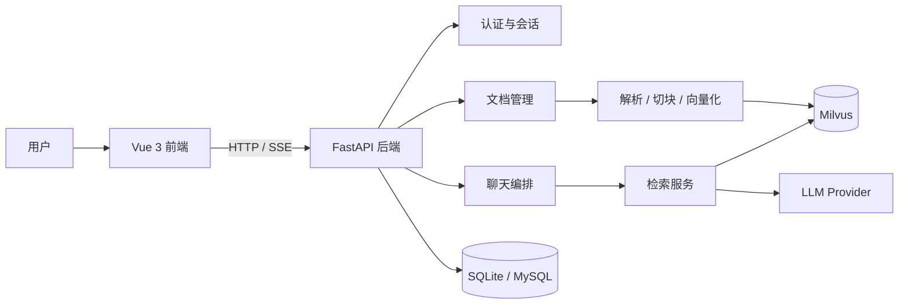
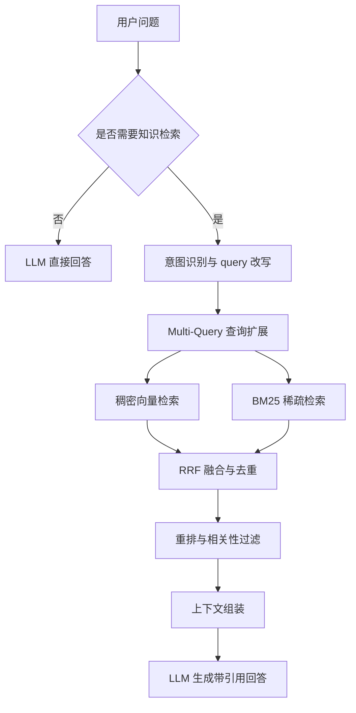

# 企业知识库问答系统


一个面向企业内部资料的 RAG 问答系统。支持文档上传、自动切块、向量化、混合检索、流式回答、引用资料展示、会话记忆与账号管理，适合制度查询、流程问答、FAQ 检索和表格型资料检索。

支持闲聊，也支持文档检索。聊得越久，会越懂你的个性化助手。

## 项目亮点

- 智能路由：先判断问题是直接回答还是进入知识库检索，再走对应流程。
- 检索增强：支持 query 改写、多查询扩展、稠密检索、稀疏检索、RRF 融合和重排。
- 可追溯回答：回答支持 Markdown，引用资料可展开查看。
- 文档管理：支持上传、预览、删除、状态跟踪和多格式办公文档入库。
- 记忆能力：支持会话记忆、长期记忆和用户画像记忆。
- 体验优化：新对话提供欢迎页和快捷问题，适合快速开始。

## 工作流程

### 整体架构



### 检索流程



## 核心能力

### 文档入库

- 支持 PDF、TXT、Markdown、Word、PowerPoint、Excel 等常见文件。
- 自动完成解析、切块、向量化和索引写入。
- 支持文档状态追踪、正文预览和删除。

### 问答体验

- 问题先做意图识别，再决定直答或检索。
- 口语化、模糊问题会自动改写成更适合检索的表达。
- 回答支持 Markdown，结构更清楚。
- 命中知识库时可展示引用资料。

### 检索能力

- 稠密检索 + 稀疏检索 + 混合检索。
- Multi-Query 扩召回。
- RRF 融合、重排和相关性过滤。
- 支持父子块上下文回收，提升表格和分块文档的可读性。

### 会话与记忆

- 支持多会话管理、切换、删除。
- 支持长期语义记忆。
- 支持用户画像记忆，适合形成个性化助手。

### 前端体验

- 新对话欢迎页带快捷问题。
- 支持闲聊和知识库问答同屏体验。
- 结果展示简洁，引用资料可按来源查看。

## 技术栈

| 模块 | 技术 |
| --- | --- |
| 前端 | Vue 3、Vite、Lucide |
| 后端 | Python、FastAPI、Uvicorn、SQLAlchemy、Loguru |
| 检索 | LangChain、BGE Embedding、BM25、RRF、Reranker |
| 模型服务 | Ollama、OpenAI、DeepSeek、OpenRouter、Anthropic |
| 存储 | Milvus / Milvus Lite、SQLite（默认）、MySQL（可选） |
| 部署 | Docker、Docker Compose |

## 快速开始

### 运行环境

- Python 3.10+
- Node.js 18+
- Milvus 2.x 或 Milvus Lite
- 一个可用的大模型服务

### 本地开发

1. 配置后端环境

```bash
cd backend
python -m venv .venv
.venv\Scripts\Activate.ps1
pip install -r requirements.txt
Copy-Item .env.example .env
```

2. 启动后端

```bash
uvicorn app.main:app --host 0.0.0.0 --port 8000 --reload
```

3. 启动前端

```bash
cd ../frontend
npm install
npm run dev
```

前端默认访问 `http://127.0.0.1:5173`。

### Docker 部署

先准备容器配置文件：

```bash
# 后端
cp backend/.env.example backend/.env

# 前端
cp frontend/.env.example frontend/.env
```

然后按你的部署方式补齐这些值：

| 文件 | 关键项 | 说明 |
| --- | --- | --- |
| `backend/.env` | `LLM_PROVIDER` | 选择模型供应商，如 `deepseek`、`ollama`、`openai` |
| `backend/.env` | `DEEPSEEK_API_KEY` / `OPENAI_API_KEY` / `OPENROUTER_API_KEY` / `ANTHROPIC_API_KEY` | 按所选模型服务填写 |
| `backend/.env` | `VECTOR_STORE_TYPE` | `milvus` 使用服务端 Milvus；`milvus_lite` 使用本地轻量文件库 |
| `backend/.env` | `MILVUS_HOST` / `MILVUS_PORT` | `VECTOR_STORE_TYPE=milvus` 时指向可访问的 Milvus 地址 |
| `backend/.env` | `MILVUS_LITE_PATH` | `VECTOR_STORE_TYPE=milvus_lite` 时的本地向量库文件路径 |
| `backend/.env` | `DATABASE_URL` | 默认 SQLite；如启用 MySQL 可改为 `mysql+pymysql://...@mysql:3306/rag_db?charset=utf8mb4` |
| `backend/.env` | `JWT_SECRET_KEY` | 生产环境请替换为强随机密钥 |
| `frontend/.env` | `VITE_API_BASE_URL` | 容器同域部署保持 `/api/v1` 即可 |

### Compose 服务说明

| 服务 | 端口 / 挂载 | 说明 |
| --- | --- | --- |
| `backend` | `8000`，挂载 `backend/models`、`backend/app/data`、`backend/app/logs`、`backend/.env` | FastAPI 后端容器，本地 BGE 模型从 `backend/models` 读取 |
| `frontend` | `80:80` | Nginx 前端容器，反向代理 `/api/v1` 到后端 |
| `mysql` | `3306`，`profile=mysql` 时启用 | 可选元数据数据库 |

```bash
docker compose up -d --build
```

2 核 4G 展示服务器建议使用 Milvus Lite 覆盖配置：

```bash
docker compose -f docker-compose.yml -f docker-compose.lite.yml up -d --build
```

如需 MySQL：

```bash
docker compose --profile mysql up -d --build
```

> 注意：常规 Compose 不包含服务端 Milvus，请将 `MILVUS_HOST` 配置为可访问的 Milvus 地址；低配展示环境可使用 `docker-compose.lite.yml`，向量数据会持久化到 `backend/app/data/milvus_lite.db`。  
> 如果你使用 MySQL，请同时把 `backend/.env` 里的 `DATABASE_URL` 切换到 MySQL 连接串，并按需修改 `MYSQL_ROOT_PASSWORD`、`MYSQL_DATABASE`、`MYSQL_USER`、`MYSQL_PASSWORD`。

## 配置说明

更多配置请直接查看 [backend/.env.example](backend/.env.example)。

| 配置项 | 说明 |
| --- | --- |
| `LLM_PROVIDER` | 模型供应商，如 `ollama`、`openai`、`deepseek`、`openrouter`、`anthropic` |
| `VECTOR_STORE_TYPE` | 向量库模式，支持 `milvus` 和 `milvus_lite` |
| `MILVUS_HOST` / `MILVUS_PORT` | Milvus 服务地址 |
| `MILVUS_LITE_PATH` | Milvus Lite 本地文件路径 |
| `DATABASE_URL` | 元数据数据库连接，默认 SQLite |
| `BGE_MODEL_NAME` | 向量模型名称或本地路径 |
| `BGE_LOCAL_FILES_ONLY` | 是否只使用本地模型文件 |
| `JWT_SECRET_KEY` | JWT 密钥，生产环境请替换为强随机值 |

## 示例资料

仓库内置了一组演示资料，适合直接体验检索效果：

- `docs/rag_accuracy_demo/01_差旅报销制度_V2.0.docx`
- `docs/rag_accuracy_demo/02_采购审批流程.docx`
- `docs/rag_accuracy_demo/03_项目Alpha上线手册.docx`
- `docs/rag_accuracy_demo/04_产品与账号常见问题.md`
- `docs/rag_accuracy_demo/05_费用标准表.xlsx`
- `docs/rag_accuracy_demo/06_企业内部信息总表.xlsx`
- `docs/rag_accuracy_demo/07_本月工资表.xlsx`

## 项目结构

```text
.
├── backend/
│   ├── app/
│   │   ├── api/          # 接口路由
│   │   ├── core/         # LLM、Embedding、常量
│   │   ├── rag/          # 检索实现
│   │   ├── services/     # 业务编排
│   │   ├── storage/      # SQLite / Milvus 访问
│   │   └── main.py
│   ├── tests/
│   ├── Dockerfile
│   └── requirements.txt
├── frontend/
│   ├── src/
│   ├── Dockerfile
│   ├── nginx.conf
│   └── package.json
├── docs/
│   ├── images/demo.png
│   └── rag_accuracy_demo/
├── docker-compose.yml
├── docker-compose.lite.yml
└── README.md
```

## 使用建议

- 文档标题尽量写清主题、版本和生效日期。
- 表格类内容尽量保留表头，不要只放截图。
- 对例外情况单独成节，写清触发条件和审批人。
- 需要更准的结果时，问题里补充金额、时间、部门、项目或环境。

## 许可证

本仓库当前未单独声明许可证，默认请按作者说明使用。
