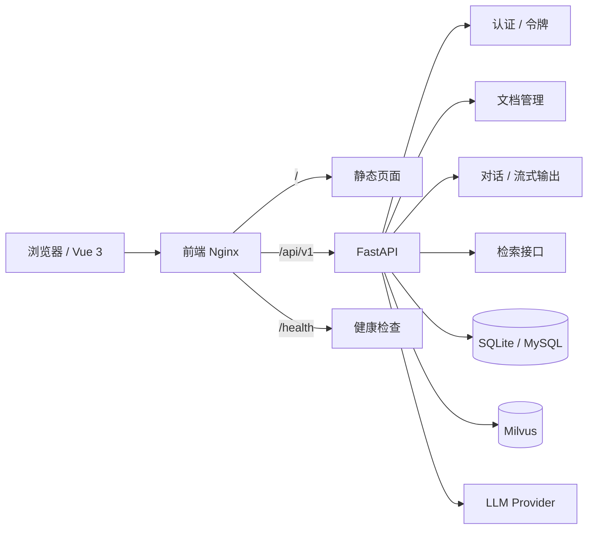
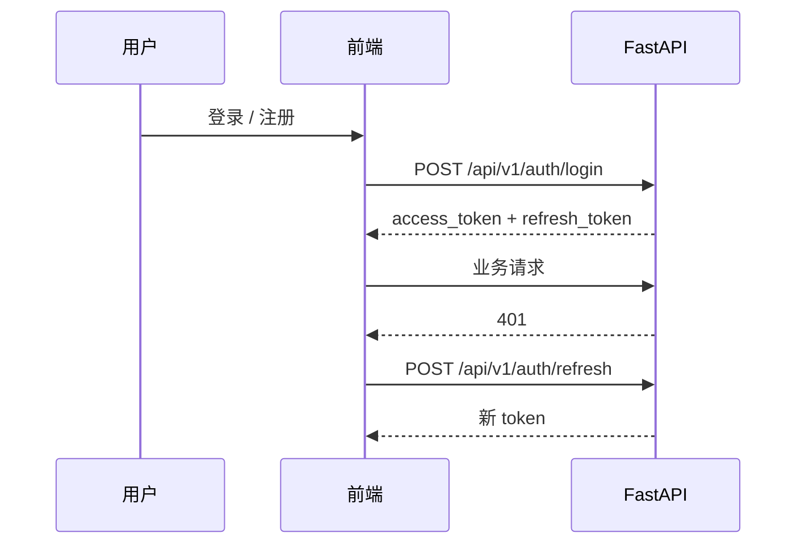
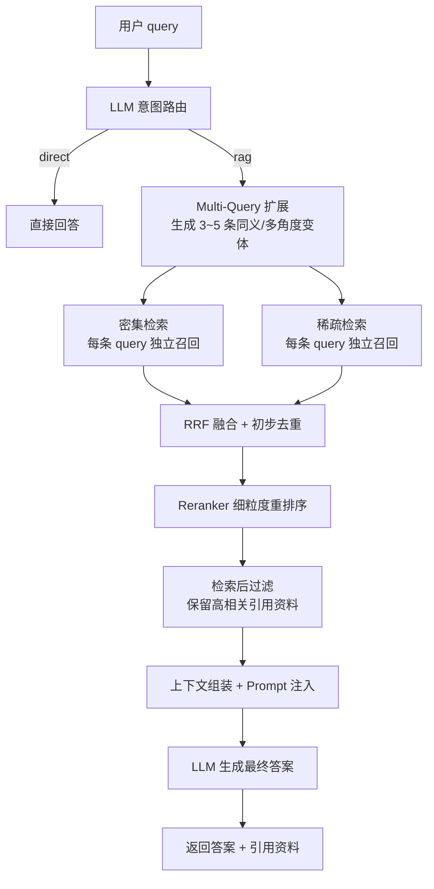

# Enterprise Knowledge System

一个支持文档上传、检索问答、流式聊天、账号注册登录、刷新令牌和修改密码的企业知识库系统。

## 项目概览



## 目录结构

```text
backend/
  app/
    api/        # 路由与请求/响应模型
    core/       # LLM、Embedding 等核心能力
    services/    # 认证、文档、聊天、记忆、检索
    storage/     # SQLite / Milvus 存储
    data/       # SQLite 数据文件固定目录
    logs/       # 日志目录
frontend/
  src/         # Vue 3 前端
  Dockerfile   # 前端镜像
  nginx.conf   # Nginx 反向代理配置
docker-compose.yml
DEPLOYMENT.md
```

## 运行流程

1. 前端发起登录、注册、刷新令牌、改密请求。
2. FastAPI 返回 `access_token` 和 `refresh_token`。
3. 前端自动在 401 时使用 refresh token 续签。
4. 文档上传后进入处理流程，写入元数据数据库并同步到向量库。
5. 聊天请求先做意图路由，命中知识库意图后再进入完整 RAG 流程，支持流式和非流式输出。
6. SQLite 元数据固定落在 `backend/app/data/rag_metadata.db`，不会散到其他目录。



## 完整 RAG 流程



流程说明：

1. 先由 LLM 判断当前 query 是直接回答还是需要进入 RAG。
2. 如果需要 RAG，先生成 3 到 5 条同义、多角度的查询变体。
3. 每条查询变体分别进入密集检索和稀疏检索。
4. 检索结果先做 RRF 融合和初步去重。
5. 再经过 reranker 细粒度重排和过滤，只保留更精确的引用资料。
6. 最后把资料组装进 Prompt，由 LLM 基于资料生成最终答案。

## 环境变量

### 后端

复制 `backend/.env.example` 为 `backend/.env`。

重点变量：

- `DATABASE_URL=sqlite:///./app/data/rag_metadata.db`
- `JWT_SECRET_KEY`
- `BOOTSTRAP_ADMIN_USERNAME=admin`
- `BOOTSTRAP_ADMIN_PASSWORD=123456`
- `LLM_PROVIDER`
- `OLLAMA_BASE_URL` / `OLLAMA_MODEL`
- `MILVUS_HOST` / `MILVUS_PORT` / `MILVUS_DB_NAME`
- `UPLOAD_DIR` 固定到 `backend/app/data/uploads`

说明：

- SQLite 数据只保留在 `backend/app/data`。
- 上传文件只保留在 `backend/app/data/uploads`。
- 如果切换到 MySQL，把 `DATABASE_URL` 改成 `mysql+pymysql://...`。
- 如果 LLM、Milvus 不在本机，要把地址改成服务器可达的地址。

### 前端

复制 `frontend/.env.example` 为 `frontend/.env`。

- `VITE_API_BASE_URL=/api/v1` 适合同域或 Nginx 反代部署。
- 前后端分域时，把它改成完整的后端地址。

## 本地启动

### 后端

```bash
cd backend
python -m venv .venv
.venv\\Scripts\\Activate.ps1
pip install -r requirements.txt
copy .env.example .env
uvicorn app.main:app --host 0.0.0.0 --port 8000
```

### 前端

```bash
cd frontend
npm install
copy .env.example .env
npm run dev
```

Vite 默认会把 `/api/v1` 代理到后端 `http://127.0.0.1:8000`。

## Docker 部署

```bash
docker compose up -d --build
```

如果要启用 MySQL profile：

```bash
docker compose --profile mysql up -d --build
```

说明：

- 前端容器使用 Nginx 提供静态页面，并反代 `/api/v1`。
- 后端容器启动 FastAPI。
- SQLite 持久化要确保 `backend/app/data` 被挂载保存。
- 如果还要持久化上传文件和缓存，建议再把容器里的 `/app/data` 额外挂载出来。
- MySQL profile 里的 `MYSQL_ROOT_PASSWORD`、`MYSQL_DATABASE`、`MYSQL_USER`、`MYSQL_PASSWORD` 可按需覆盖。

## 反向代理

前端 Nginx 会把：

- `/api/v1/` 转发到后端服务
- `/health` 转发到后端健康检查

## 接口概览

### 认证

- `POST /api/v1/auth/login`
- `POST /api/v1/auth/register`
- `POST /api/v1/auth/refresh`
- `POST /api/v1/auth/password`
- `GET /api/v1/auth/me`

### 文档

- `GET /api/v1/documents/list`
- `POST /api/v1/documents/upload`
- `GET /api/v1/documents/content/{document_id}`
- `DELETE /api/v1/documents/delete/{document_id}`

### 检索

- `POST /api/v1/retrieval/search/hybrid`
- `POST /api/v1/retrieval/search/dense`
- `POST /api/v1/retrieval/search/sparse`

### 聊天

- `GET /api/v1/chat/settings`
- `POST /api/v1/chat/generate`
- `POST /api/v1/chat/stream`
- `DELETE /api/v1/chat/conversations/{conversation_id}`

### 健康检查

- `GET /health`

## 默认账号

系统启动后会自动创建默认管理员：

- 用户名：`admin`
- 密码：`123456`

## 生产注意事项

- 把 `DEBUG` 改成 `false`
- 把 `JWT_SECRET_KEY` 换成强随机值
- 把 `CORS_ORIGINS` 改成真实域名
- 不要提交真实 `.env`
- 不要提交 `node_modules`、`.vite`、`dist`

## 许可证

未声明。
